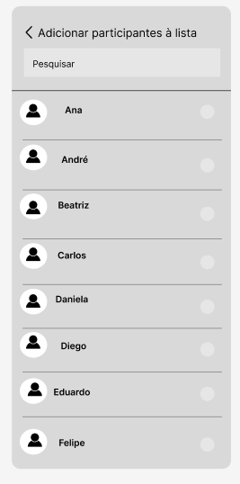

# Projeto de Interface

Para atingir nosso objetivo de promover uma interação mais integrada e eficaz para os colaboradores, desenvolvemos uma interface de aplicação que se concentra na acessibilidade, agilidade e usabilidade. Priorizamos um design visual sóbrio que direciona o foco para o conteúdo principal, e responsividade em todos os tipos de dispositivos móveis.

## Diagrama de Fluxo

O diagrama de fluxo é uma representação visual do fluxo sistemático de dados, criado com o propósito de facilitar o planejamento das interações e aprimorar a qualidade do desenho dos wireframes que estão na sequência logo abaixo.

## Wireframes

Wireframes são protótipos utilizados no design de interfaces para indicar a estrutura de uma aplicação e as conexões entre suas páginas. Eles consistem em representações visuais que se aproximam do layout dos elementos fundamentais da interface. Logo abaixo, apresentamos os wireframes da aplicação móvel 2Gather.
 
### Home
 Esta é a tela inicial que o usuário encontrará ao abrir o aplicativo 2Gather. Nela, encontramos uma mensagem de boas-vindas, o logotipo e um botão que permite ao usuário efetuar o login.
 
 

### Login
 Nesta tela, você encontrará campos para inserir seu e-mail e senha, uma opção de recuperação de senha (que enviará instruções para atualizar a senha para o e-mail cadastrado) e o botão de entrada.
 
 
 ### Tela inicial
 Esta é a tela central de nossa aplicação, onde os usuários encontrarão uma variedade de opções, incluindo a criação de novos grupos, a visualização da lista de transmissão, configurações, contatos e acesso a todas as conversas em sua posse.
 
 

  ### Tela inicial - ADMIN
 Esta é a tela central da nossa aplicação na versão de usuário administrador. A diferença entre o acesso de um usuário comum e o de um administrador está na disponibilidade da opção de Gerenciamento de Usuários.
 
 

   ### Gerenciamento de usuários - ADMIN
 Esta tela, exclusiva para usuários administradores, oferece recursos de gerenciamento de usuários, proporcionando três opções: Criar Usuário, Editar Usuário ou Inativar Usuário.
 
 

### Criar usuário - ADMIN
 Se o usuário optar por criar um novo usuário, deverá fornecer um ID para o usuário, um e-mail corporativo, o nome do colaborador, o setor, o cargo e, por fim, selecionar a opção "Criar".
 
 

 ### Editar usuário - ADMIN
Se o usuário escolher editar um usuário, ele deve fazer as alterações apenas no campo desejado, seja o ID, o e-mail corporativo, o nome do colaborador, o setor ou o cargo. Depois, basta clicar em "Salvar" ou "Cancelar".
 
 

  ### Inativar usuário - ADMIN
Se o usuário escolher inativar um usuário, precisará fornecer o ID do usuário, o email corporativo, o nome do colaborador, o motivo e, em seguida, clicar em "Inativar" para confirmar ou em "Cancelar" para desistir.
 
 
 
  ### Contatos
 Aqui, o usuário poderá pesquisar e visualizar sua lista completa de contatos, permitindo também o início de novas conversas.
 
 

### Conversas
 Neste espaço, o usuário pode visualizar suas conversas com outros usuários, digitar mensagens de texto e, adicionalmente, permite que o remetente saiba quando sua mensagem foi lida pelo destinatário, fornecendo uma confirmação de leitura.
 
 

### Notificação de mensagem
 A aplicação emite notificações para informar ao usuário que uma nova mensagem foi recebida.
 
 

 ### Configurações
 Neste espaço, o usuário terá acesso às suas informações básicas de perfil, poderá visualizar seus grupos arquivados e sair da aplicação.
 
 

  ### Grupos arquivados
 Neste local, o usuário poderá visualizar os grupos que foram arquivados por ele.
 
 

### Listas de transmissão
 Nesta tela, o usuário tem acesso a um botão que possibilita iniciar a criação de uma nova lista de transmissão.

 

### Adicionando participantes à nova Lista de transmissão
 Continuando com o processo de criação de uma nova lista de transmissão, o usuário agora deve selecionar os contatos que deseja incluir em sua lista de transmissão.

 

### Fase final da criação da Lista de Transmissão
 Esta é a última fase para criar uma lista de transmissão. Após selecionar os contatos desejados, o usuário deverá escolher a opção "Criar".

 

 ### Lista de Transmissão criada
 Após seguir os passos anteriores, o usuário agora possui sua lista de transmissão pronta e pode começar a enviar suas mensagens.

 

### Listagem das Listas de Transmissão
Nesta tela, o usuário terá uma visão completa de todas as suas listas de transmissão, poderá editá-las ou criar novas listas.

 

### Lista de Transmissão - Editar
Neste espaço, o usuário pode apagar listas de transmissão existentes ou criar novas listas

 

### Lista de Transmissão - Informações
Nesta tela, o usuário pode visualizar os destinatários da lista e realizar edições, como a remoção de participantes existentes ou a adição de novos.

 

### Lista de Transmissão - Adicionar/Remover participantes
Neste layout, o usuário, que é o administrador da lista, tem a capacidade de adicionar novos participantes à lista e remover participantes existentes conforme necessário.

 

### Novo grupo
A partir da tela inicial, conforme mencionado anteriormente, os usuários também têm a opção de criar grupos. Este wireframe ilustra o primeiro passo desse processo, no qual o usuário pesquisa os contatos desejados e os seleciona.

 

 ### Novo grupo - participantes selecionados
Uma vez selecionados os participantes, o usuário pode revisar a lista de escolhidos antes de prosseguir com a criação do grupo ou optar por cancelar.

 

  ### Fase final para criar novo grupo
Após a decisão do usuário de criar um novo grupo, basta selecionar a opção "Criar".

 

### Novo grupo criado
Após completar as etapas anteriores, o usuário agora tem seu grupo pronto e pode iniciar o envio de mensagens.

 

 ### Grupo - Editar
Nesta tela, o usuário, que é o administrador do grupo, pode visualizar os participantes do grupo, adicionar novos membros ou arquivar o grupo.

 

  ### Grupo - Adicionar novos participantes
Nesta seção, o usuário, na qualidade de administrador do grupo, pode examinar sua lista de contatos e selecionar novos membros para o grupo. Os contatos que já fazem parte do grupo serão identificados com uma mensagem abaixo de seus nomes, indicando sua inclusão no grupo, e um sinal de marca de seleção logo ao lado dessa mensagem.

 
